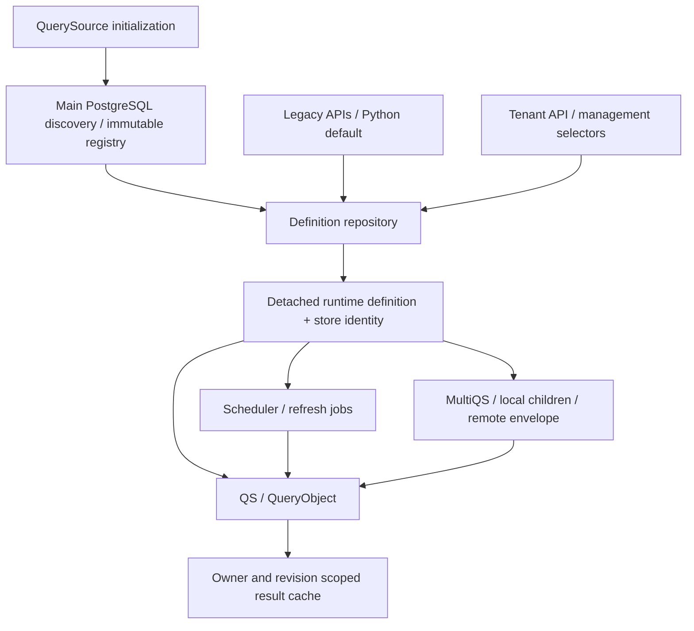

# Feature Specification: Per-tenant Queries

**Feature ID**: FEAT-147
**Date**: 2026-09-15
**Author**: Jesus Lara / Codex
**Status**: approved
**Target version**: 5.0.0 (proposed major-release target)

**Input**: [per-tenant-queries.proposal.md](../proposals/per-tenant-queries.proposal.md)
**Research and decisions**: [FEAT-176 audit](../state/FEAT-176/)

Identity provenance: the proposal owns the research identifier FEAT-176. The
spec workflow's `existing_feature_id()` checks specs/task indexes, returned no
existing allocation, and its mandatory CAS allocator reserved FEAT-147 for this
spec. Implementation tasks must use FEAT-147 and this slug; FEAT-176 remains the
historical proposal/audit reference. Do not allocate another ID when revising.

## 1. Motivation & Business Requirements

### Problem Statement

QuerySource reads saved definitions from one configured PostgreSQL table,
`public.queries` by default. Clients need independent `{tenant}.queries` tables
with overlapping query slugs, discovered from the main PostgreSQL database.
Existing execution and management clients must continue to work. Ownership must
survive every definition read, write, child execution, cache operation and job.

A tenant owns a definition prepared for that client's consumption. Its SQL may
join other schemas or use other data sources under existing permissions.
Ownership selection does not establish a database sandbox.

### Goals

- Discover tenant stores containing a `queries` base table and `query_slug`
  column; validate compatibility and publish a startup registry.
- Accept `QuerySource(tenant_allowlist=None)`, with exact-name allowlisting.
- Add one tenant execution handler for single and multi-query definitions,
  collection listing, and tenant selection on existing management CRUD.
- Preserve legacy routes, configuration overrides, response conventions,
  provider/parser contracts, credentials and optional PBAC.
- Remove persisted `program_slug` from tenant tables while deriving runtime
  program context from the owner. Provisionally retain `program_id`.
- Make identical slugs safe across stores in concurrent and background work.

### Non-Goals (explicitly out of scope)

Automatic data movement, schema creation at server startup, changes to SQL
accessed schemas, tenant-local copies of datasources/credentials/variables,
mandatory membership authorization, mandatory PBAC, runtime registry refresh,
eager definition caching, distributed scheduler leader election, and arbitrary
SQL parsing to enforce ownership are excluded. Existing explicit output
locations and datasource targets remain caller-controlled.

## 2. Architectural Design

### Overview

Use an immutable store identity and one definition repository. Resolve an owner
before reading a definition; never encode owner selection as a query condition,
`program`, datasource name, shared ORM metadata change or connection
`search_path` change. Server startup discovers stores; definitions remain
on-demand reads. Direct Python usage receives the same repository through the
QuerySource connection service and can initialize it asynchronously without an
HTTP request.

The repository uses **explicitly schema-qualified, parameterized SQL** for
storage operations. Reuse `QueryModel` for legacy validation and for a detached
runtime compatibility object, but never call its persistence methods on a tenant
runtime object. A separate plain `TenantQueryDefinition` validation model contains
all current definition fields except `program_slug`, with the same validation
and defaults. This avoids assumptions about ORM metadata inheritance and
removing inherited fields. A shared field-definition base may be extracted only
if tests establish identical legacy model metadata and serialization.

The following are specification choices implementing the proposal's baselines;
they are not additional user answers.

#### Owner and legacy-store resolution

| Input | Resolution |
|---|---|
| No tenant / Python or JSON `None` | Configured `QS_QUERIES_SCHEMA.QS_QUERIES_TABLE`; default `public.queries`. |
| Explicit nonempty tenant | Exact registered schema, fixed table `queries`. |
| Explicit `public` | Literal `public.queries`, independently from configured default. |
| Child definition without `tenant` | Inherit parent's resolved store. |
| Child definition with `tenant: null` | Explicit configured legacy store. |
| Unknown/disallowed owner or missing slug | Fail; never search another owner. |

Physical identity is `(database namespace, schema, table)`. Configure the database
namespace from the existing main PostgreSQL database/host/port settings without
including passwords; hash its canonical representation. The same physical store
has one registry entry, cache namespace and scheduled job set even when reachable
through both legacy and explicit selectors. Public and configured legacy stores
use the legacy row contract, retaining persisted `program_slug`. Other tenant
stores use the tenant row contract. Discovery of the configured legacy table
must not relabel it as a tenant table or derive a replacement program value.

`None` allowlist registers all compatible discovered explicit stores; `[]`
registers none; a supplied collection registers only exact names. Omitted legacy
access always remains available. Explicit selectors, including `public` and an
alias of the configured legacy store, still require allowlist eligibility.
Reject a string passed as a collection and non-string/empty members. Duplicate
names collapse. Tenant strings are not trimmed, lowercased or Unicode-normalized.

#### Registry lifecycle and discovery

1. Open the existing main metadata connection on the running event loop.
2. Join `information_schema.tables` and `information_schema.columns` on catalog,
   schema and table; select `table_name = 'queries'`, `column_name = 'query_slug'`
   and `table_type = 'BASE TABLE'` in the current database.
3. Exclude `information_schema`, `pg_catalog` and `pg_`-prefixed schemas. Exclude
   `management` from explicit tenant registration because legacy management
   routes occupy that URL space. Record a diagnostic if requested explicitly.
4. Inspect all candidate column/type metadata in a bounded set of catalog reads,
   not by loading every query definition. Validate the model's complete column
   contract, string-compatible non-null unique `query_slug`, and required read
   access. Use catalog constraint inspection to verify slug uniqueness. Missing
   marker means not a candidate; incompatible shape means excluded with reason.
   Lack of mutation grants does not prevent read-only registration; CRUD returns
   a controlled permission error.
5. Publish one immutable snapshot before scheduler loading and readiness. Include
   eligible stores plus diagnostics for incompatible and explicitly requested
   missing/invisible/disallowed names. Metadata is role-visible, not a complete
   inventory of objects the service role cannot see.

A failed catalog scan fails startup, with no partial registry published.
Individual incompatible candidates are skipped with diagnostics; unknown allowed
names do not redirect or prevent usable stores from starting. The legacy store
retains its existing on-demand validation behavior. A runtime dropped/revoked
store produces an unavailable-store error, not a re-discovery or public fallback.
Restart is required to change the registry or allowlist. Repeated singleton
initialization with different ownership configuration raises a configuration
error rather than silently broadening access. Threaded execution receives the
immutable snapshot and obtains a connection on its own loop; it must not reuse
an event-loop-bound pool from the HTTP loop.

#### Persistence and runtime shape

Tenant persistence has the fields in `QueryModel` except `program_slug`, including
`program_id` (required, application default 1 as the provisional baseline),
`cache_timeout`, `cache_refresh`, `dwh`, timestamps, JSONB and array fields.
Extra database columns are permitted only if inserts can omit them (nullable,
generated or defaulted). A nonlegacy candidate containing `program_slug` is
incompatible with the new tenant contract; it needs an explicit migration.

Read/write operations return persisted fields to management clients. A separate
runtime adapter creates a detached `QueryModel` with `program_slug=store.schema`
for tenant definitions. Providers and compiled parsers continue to receive
attribute access and current field types. Legacy objects retain their persisted
program value. The adapter is never exported as tenant DDL, schema metadata,
INSERT SQL or CRUD payload. Tenant writes supplying `program_slug` return 400;
filtering/sorting/projecting/searching that column also returns 400.

All value predicates use PostgreSQL positional parameters; quote identifiers by
surrounding each registry-validated component with double quotes and doubling
embedded double quotes. Reject NUL and invalid route selectors before lookup;
support case-sensitive, space, hyphen and quoted schema identifiers that can be
represented in a decoded URL segment. Slash-containing schema names are excluded
with diagnostics. Never interpolate a request's raw tenant string into SQL.

Repository operations cover get/list/count/create/upsert/patch/delete, management
metadata and INSERT export. Preserve defaults, JSON serialization, timestamp
handling, validation status mapping and existing PUT/POST upsert semantics.
PATCH cannot move a row between stores or change the URL slug; path/payload slug
conflicts return 400. A tenant selector chooses the store for the entire request,
including any list, existence check or SQL export. Tenant collection responses
use the same pagination envelope, count headers, empty 204 behavior and limits as
current management listing. Legacy accepted filters/sorts stay accepted; tenant
column policy derives from the tenant model. Page and count use identical filters.

#### HTTP and Python interfaces

| Route | Contract |
|---|---|
| Existing v2 service/test/column routes | Bound to configured legacy store; preserve methods, suffixes and responses. |
| Existing v3 query routes | Bound to configured legacy store; preserve single fallback and multi behavior. |
| `GET /api/v1/{tenant}/queries/` | Tenant definitions listing, not execution. |
| `POST /api/v1/{tenant}/queries/` | Inline multi execution, inheriting tenant for saved children. |
| `GET, POST /api/v1/{tenant}/queries/{slug}` | Unified stored single/multi execution; preserve output suffix parsing. |
| `HEAD, PATCH /api/v1/{tenant}/queries/{slug}` | Column inspection with existing single/multi response semantics. |
| `GET, POST /api/v1/{tenant}/queries/{slug}/test` | Stored-definition dry-run using the selected owner. |
| Existing `/api/v1/management/queries` family | All CRUD, `:meta` and `:insert` accept tenant selector. |
| Existing raw executor `/api/v1/queries/test`, `/run`, `/schema` | Existing datasource and raw SQL behavior. |

Register explicit legacy routes first. Register tenant collection with and
without trailing slash directly, preserving POST bodies without redirects.
Reserve `management` and test route precedence including literal `queries`,
`test`, `qs`, slug output suffixes, collection `:meta` and `:insert`. Tenant schema
metadata and exports use the existing management interface, not a second CRUD API.

For management GET/DELETE use `?tenant=...`; writes additionally accept a top-level
JSON `tenant`. For tenant execution the URL is authoritative; any supplied routing
selector must agree. Multiple query-string values are accepted only when equal.
JSON null is a real selection of legacy, distinct from no selector. Empty string,
non-string selectors and conflicts return 400. The literal URL string `null`
is an ordinary schema name, not JSON null. Strip selectors before field validation,
pagination, provider conditions and remote routing. On legacy execution URLs a
`tenant` value remains an existing ordinary condition if previously accepted;
it can never redirect definition storage. Python callers select ownership only
through the new keyword argument, not `conditions['tenant']`.

New ownership errors have stable machine codes: `invalid_tenant` (400),
`tenant_not_available` (404 for unknown/disallowed/incompatible selector),
`query_not_found` (404), `tenant_store_unavailable` (503 for runtime store loss),
`tenant_write_forbidden` (403 for database mutation permission failure), and
`tenant_worker_unsupported` (502 at the remote boundary). Existing legacy errors
retain their response format/status; use the current error envelope for new codes.
Do not return raw SQL, credentials or discovered schema inventories in errors.

#### Nested execution and current access controls

For `queries: {alias: {slug: 'report', tenant: 'client_b', ...}}`, `alias` remains
an output label and `slug` is the actual stored reference. Omitted tenant inherits;
explicit null selects legacy. Apply the same rule to Query source components and
single-query fallback. Copy user/saved configuration before extracting routing
keys. Resolve all stored references and existing PBAC checks before execution of
a known batch, including children expanded from stored multi definitions. A
missing/disallowed reference fails the batch; do not partially execute it.

Keep authentication, credentials, resource actions and slug-based policy matching
compatible. No tenant membership check is introduced. Carry owner in request
context/logs. The installed evaluator has no per-call cache-bypass argument and its cache
key includes numeric auth org/client IDs, not QuerySource schema ownership. For
each tenant check, use a shallow copy of the existing evaluator with a fresh
`_cache` dictionary and copied `_stats`, call its existing `check_access`, then
discard that evaluation copy. Keep the current policy index and configuration;
never mutate the app evaluator's cache, TTL or policy names. This request-local
adapter prevents cross-owner cached decisions while preserving current rules and
hot-reload behavior (a new check copies the current evaluator). Legacy evaluation
stays unchanged. Numeric auth tenants are not inferred from schema names. PBAC-disabled
execution remains supported. Programmatic/scheduled/worker calls preserve their
existing trusted-service credential model.

#### Cache, jobs, remote execution and outputs

- Use a central result-key format `qs:r2:<sha256(canonical tuple)>`. The tuple
  contains physical store identity, slug, definition revision and existing
  provider checksum. Revision is a stable hash of canonical persisted fields,
  with ordered keys and explicit date/array/null encodings, not just `updated_at`.
  Preserve every provider-specific checksum as an input. Raw executions in an
  owner context include that context and their existing SQL checksum.
- All cache reads, threaded writes and refreshes use this key. Do not dual-read
  old unqualified keys, including for legacy: rollout intentionally starts cold.
  Old keys expire by existing TTL. Same physical-store aliases share identity;
  different owners with identical SQL do not. TTL and refresh options stay intact.
  An in-flight old definition can write only its old revision key; a newly read
  edited definition cannot see it. Deleted definitions are checked before cache
  lookup and return missing. Out-of-band definition edits are covered by revision
  hashing on each lookup. This does not claim to fix pre-existing user-dependent
  result-cache behavior; credential resolution must remain unchanged.
- Scheduler uses the repository to load each unique registered store, removing
  its hardcoded public SQL. Preserve legacy `query_<slug>`, `multi_<slug>`,
  `cache_<slug>` IDs for the configured default store. For all other stores use
  `qsj2:<kind>:<store_digest>:<encoded_slug>` with reversible URL-safe slug encoding.
  Every job carries canonical schema/table/contract and tenant selection. Validate
  the current registry on deserialization. Live sync, removal, pause, resume and
  refresh operate on that identity. Keep `notify(job_id, slug, error)` unchanged;
  qualified IDs and structured log fields provide ownership.
- Management mutations commit first, then synchronize only the affected owner's
  jobs when the scheduler is active. A scheduler synchronization failure must be
  reported in a response header `X-QS-Scheduler-Sync: failed` and logged; it must
  not pretend the database transaction rolled back. Restart rebuilds schedules.
- Legacy remote dispatch keeps `querysource.remote.query_handler`. Tenant dispatch
  uses **`querysource.remote.tenant_query_handler_v1`**, a distinct externally
  deployed callable whose required `owner` envelope includes protocol version,
  database namespace, schema, table and contract. The worker validates those values
  against its own initialized registry/allowlist, selects its own credentials and
  executes the addressed definition. Unknown callable or unsupported protocol
  fails explicitly, with no retry through the legacy handler or local execution.
  Sending a permissive legacy handler an extra `tenant` kwarg is insufficient.
  Define the contract and client transport here; external worker rollout is a
  tenant-remote release gate, not a claim that its implementation exists here.
- Include owner/store and slug in HTTP, Python, child, remote and scheduled timing
  events and failures. Pass a collision-resistant owner/request-derived internal
  filename to implicit tenant output artifacts. Preserve legacy download names;
  explicit caller destination names/paths remain intentional. Never prepend an
  owner to configured database/table output destinations. Streaming writers need
  no storage-schema change.

### Component Diagram



### Integration Points

| Existing Component | Integration Type | Notes |
|---|---|---|
| QuerySource / QueryConnection | Extends lifecycle | Registry after metadata connection, before scheduler/readiness. |
| Connection / QueryModel | Repository boundary | Preserve per-call connections; separate storage/runtime shapes. |
| QueryManager / pagination | Routes storage operations | Owner-specific projections, metadata, exports and values. |
| QS / MultiQS / QueryObject / ThreadQuery | Context propagation | Immutable identity across loops, aliases and worker transport. |
| Providers / compiled parsers | Compatible adapter | Program derived only for tenant runtime definitions. |
| Cache / scheduler / notifications | Identity propagation | No unqualified tenant keys or job identifiers. |
| Existing authentication / PBAC / outputs | Preserve integration | Current controls, owner-aware diagnostics and implicit artifacts. |

### Data Models

The following are new internal types; `Any`, `Mapping`, `Sequence`, `Callable`,
`Awaitable`, `AsyncContextManager` and dataclasses come from Python's standard
library. `QueryModel` and `pg` refer to verified existing types in §6.

```python
@dataclass(frozen=True)
class QueryStore:
    """Canonical physical identity and validated persistence contract."""
    database_namespace: str
    schema: str
    table: str
    contract: Literal['legacy', 'tenant']
    columns: frozenset[str]

@dataclass(frozen=True)
class QueryIdentity:
    """A saved definition identity; aliases never replace its slug."""
    store: QueryStore
    slug: str

@dataclass(frozen=True)
class LoadedDefinition:
    """Detached runtime model plus immutable persisted-revision identity."""
    identity: QueryIdentity
    runtime: QueryModel
    revision: str

@dataclass(frozen=True)
class DefinitionPage:
    """Persisted projections and total matching the same validated filters."""
    rows: tuple[Mapping[str, Any], ...]
    total: int

class TenantOwnerEnvelope(TypedDict):
    """Versioned remote/job identity; no database secrets or connections."""
    version: Literal[1]
    database_namespace: str
    schema: str
    table: str
    contract: Literal['legacy', 'tenant']
```

Frozen wrappers must not expose mutable shared row/JSON dictionaries. Runtime
models are fresh per execution; cache identity/revision are computed from an
immutable snapshot before any parser/provider mutation.

### New Public Interfaces

`QuerySource(tenant_allowlist: Sequence[str] | None = None, **kwargs)`;
`await querysource.initialize_tenants()` for direct/lazy use; optional keyword-only
`tenant` on `QS`, `MultiQS`, `QueryObject`, definition lookup and scheduler sync.
Existing positional arguments and return contracts remain compatible. HTTP
interfaces are fixed in the route table above; exact additions are in §3.

## 3. Module Breakdown

Interface skeletons specify signatures and docstrings only. Names marked new do
not exist yet; verified anchors identify integration sites, not implemented tenant
behavior. Imports/types are shared with §2 and §6.

#### Delegation-eligible modules

| Module | Eligible? | Decided patterns / exact contracts | Why not (if no) |
|---|---|---|---|
| M1 Registry and identity | yes | Immutable snapshot; exact allowlist/diagnostics; qualified names. | — |
| M2 Repository and models | yes after DDL fixture review | Explicit SQL, separate tenant fields, runtime adapter. | Deployed DDL remains a rollout gate. |
| M3 Execution and cache | yes | Keyword ownership, revision keys, child inheritance. | — |
| M4 HTTP / management / policy | yes | Fixed routes/selectors/CRUD; request-local evaluator copy with empty cache. | — |
| M5 Child and remote transport | yes for client | Distinct worker callable; required versioned envelope. | External implementation deployment is separately gated. |
| M6 Scheduling | yes | Qualified jobs, repository reads, post-commit sync. | — |
| M7 Outputs / diagnostics / release docs | yes | Context fields, implicit artifact names, staged rollout. | — |

### Module 1: Registry and identity

- **Paths**: new `querysource/tenants.py`; modify services and connection lifecycle.
- **Responsibility**: discovery, immutable identity, selector validation and diagnostics.
- **Depends on**: existing main PostgreSQL connection.
- **Interface Skeleton**:

```python
# new: querysource/tenants.py; data classes from §2 live here
class TenantRegistry:
    """One immutable published snapshot per QuerySource initialization."""
    async def discover(self, conn: pg, *, allowlist: Sequence[str] | None) -> None:
        """Publish compatible stores atomically; scan failure publishes nothing."""
    def resolve(self, tenant: str | None = None) -> QueryStore:
        """Resolve exact selector; never fall back from an explicit name."""
    def stores(self) -> tuple[QueryStore, ...]:
        """Return unique eligible physical stores, including configured default."""
    def diagnostics(self) -> tuple[Mapping[str, Any], ...]:
        """Return administrative discovery reasons without secrets."""

def quote_identifier(value: str) -> str:
    """Quote one validated identifier, preserving case and embedded quotes."""

# modifies QuerySource; verified: querysource/services.py:65
class QuerySource:
    """Existing service; preserve Singleton metaclass and lifecycle."""
    def __init__(self, *, tenant_allowlist: Sequence[str] | None = None, **kwargs: Any) -> None:
        """Freeze ownership configuration; reject incompatible reinitialization."""
    async def initialize_tenants(self) -> TenantRegistry:
        """Idempotently initialize on the current loop for HTTP or Python use."""
    async def qs_start(self, app: WebApp) -> None:  # verified: querysource/services.py:369
        """Initialize registry/repository after connection startup and before jobs."""
```

### Module 2: Definition repository and validation

- **Paths**: new `querysource/repositories/__init__.py`, `definitions.py`,
  `querysource/tenant_models.py`; integrate `models.py`, `interfaces/connections.py`.
- **Responsibility**: sole saved-definition storage boundary, safe SQL and adapter.
- **Depends on**: M1.
- **Interface Skeleton**:

```python
# new: querysource/tenant_models.py
class TenantQueryDefinition(BaseModel):
    """Declare QueryModel's validated fields except program_slug; see §2 shape."""

# new: querysource/repositories/definitions.py
class DefinitionRepository:
    """Use qualified SQL and per-call connections for every definition operation."""
    def __init__(self, registry: TenantRegistry, connection_factory: Callable[[], Awaitable[AsyncContextManager[pg]]]) -> None:
        """Accept a loop-local connection factory, never a shared checked-out connection."""
    async def get(self, identity: QueryIdentity) -> LoadedDefinition:
        """Read current persisted row and return detached runtime model plus revision."""
    async def list(self, store: QueryStore, params: Mapping[str, Any]) -> DefinitionPage:
        """Validate owner-specific projections/filter/sort; bind page/count values."""
    async def create(self, store: QueryStore, data: Mapping[str, Any]) -> Mapping[str, Any]:
        """Validate and insert persisted fields, retaining database constraints."""
    async def upsert(self, identity: QueryIdentity, data: Mapping[str, Any]) -> tuple[Mapping[str, Any], bool]:
        """Return persisted row and created flag atomically for PUT/POST statuses."""
    async def patch(self, identity: QueryIdentity, data: Mapping[str, Any]) -> Mapping[str, Any]:
        """Update supplied mutable fields only; owner and slug cannot change."""
    async def delete(self, identity: QueryIdentity) -> bool:
        """Delete exactly this owner's row; report missing without fallback."""
    def schema(self, store: QueryStore) -> Mapping[str, Any]:
        """Return persistence metadata, excluding tenant runtime-only program_slug."""
    async def export_insert(self, identity: QueryIdentity) -> str:
        """Render safely escaped SQL for this store using persisted fields only."""
    async def schedulable(self, store: QueryStore) -> tuple[Mapping[str, Any], ...]:
        """Return scheduler candidates from one store using existing eligibility rules."""

# modifies Connection; verified: querysource/interfaces/connections.py:444
class Connection:
    """Preserve existing lookup callers and retry/missing-slug behavior."""
    async def get_query_slug(self, slug: str, evt: asyncio.AbstractEventLoop | None = None, max_retries: int = 3, *, tenant: str | None = None) -> BaseModel:
        """Delegate to repository; return compatible detached runtime definition."""
    async def get_slug(self, slug: str, program: str | None = None, evt: asyncio.AbstractEventLoop | None = None, *, tenant: str | None = None) -> BaseModel:  # verified: querysource/interfaces/connections.py:494
        """Preserve program argument; only tenant selects ownership."""
```

The repository connection factory normalizes existing pool and direct-connection
acquisition into one async context-manager contract. Do not assume asyncdb's
`query()` returns the same shape as `fetch_all()`; §6 records that distinction.

### Module 3: Execution context and result cache

- **Paths**: interfaces/queries.py, queries/base.py, queries/qs.py, queries/obj.py,
  queries/multi/__init__.py; new `querysource/cache_identity.py`.
- **Responsibility**: resolve ownership once, preserve it in all execution paths.
- **Depends on**: M1–M2.
- **Interface Skeleton**:

```python
# modifies AbstractQuery; verified: querysource/interfaces/queries.py:50
class AbstractQuery:
    """Existing Connection subclass; store fresh owner and revision context."""
    def __init__(self, slug: str | None = None, conditions: dict | None = None, request: web.Request | None = None, loop: asyncio.AbstractEventLoop | None = None, *, tenant: str | None = None, **kwargs: Any) -> None:
        """Preserve arguments; tenant is explicit routing metadata, not a condition."""
    def result_cache_key(self, provider_checksum: str) -> str:
        """Compose key from the loaded immutable definition and provider checksum."""
    def save_in_cache(self, checksum: str, result: Any, loop: asyncio.AbstractEventLoop) -> None:  # verified: querysource/interfaces/queries.py:267
        """Write the already composed key; capture identity before threading."""
    async def caching_data(self, checksum: str, result: Any) -> None:  # verified: querysource/interfaces/queries.py:296
        """Use the same composed key for TTL writes, with no second wrapping."""

# new: querysource/cache_identity.py
def definition_revision(row: Mapping[str, Any]) -> str:
    """Hash canonical persisted data before runtime mutation."""

def result_cache_key(identity: QueryIdentity, revision: str, provider_checksum: str) -> str:
    """Return the qs:r2 key; never use an unqualified compatibility read."""
```

Constructor forwarding changes are required at `BaseQuery` (verified:
querysource/queries/base.py:21), `QS` (verified: querysource/queries/qs.py:42),
`QueryObject` (verified: querysource/queries/obj.py:26) and `MultiQS` (verified:
querysource/queries/multi/__init__.py:93): preserve each exact existing signature
in §6 and add keyword-only `tenant: str | None = None` before `**kwargs`.
`build_provider()` and saved multi expansion must retain `LoadedDefinition`
identity/revision internally rather than discard it through the compatibility
`get_slug()` return value. Cache wrapping occurs at execution call sites once.

### Module 4: Tenant HTTP handler, CRUD and policy bridge

- **Paths**: new handlers/tenant.py; handlers/__init__.py, services.py,
  handlers/manager.py, handlers/_pagination.py, handlers/abstract.py, handlers/multi.py.
- **Responsibility**: route and selector contracts, shared execution/list services.
- **Depends on**: M1–M3.
- **Interface Skeleton**:

```python
# new: querysource/handlers/tenant.py
class TenantQueryHandler(AbstractHandler):  # verified: querysource/handlers/abstract.py:27
    """One tenant handler selects existing single/multi execution behavior."""
    async def list(self, request: web.Request) -> web.StreamResponse:
        """List selected tenant definitions with management pagination conventions."""
    async def query(self, request: web.Request) -> web.StreamResponse:
        """Execute stored single/multi or inline multi under URL owner."""
    async def columns(self, request: web.Request) -> web.StreamResponse:
        """Inspect selected definition using existing single/multi semantics."""
    async def test_slug(self, request: web.Request) -> web.StreamResponse:
        """Dry-run selected saved definition without executing its data query."""

def resolve_request_store(request: web.Request, registry: TenantRegistry, payload: Mapping[str, Any] | None = None) -> QueryStore:
    """Validate all present routing selectors and reject disagreement with 400."""

# modifies QueryManager; verified: querysource/handlers/manager.py:32
class QueryManager:
    """Existing QueryView subclass; preserve all public HTTP method contracts."""
    async def _paginate_list(self, qp: dict, default_args: dict, *, store: QueryStore | None = None) -> web.StreamResponse:  # verified: querysource/handlers/manager.py:145
        """Delegate page/count to repository using resolved persistence fields."""

# modifies AbstractHandler; verified: querysource/handlers/abstract.py:317
class AbstractHandler:
    """Existing base handler; preserve public policy names and actions."""
    async def _enforce_owned_slug(self, request: web.Request, identity: QueryIdentity, action: str) -> None:
        """Evaluate existing slug rules with a detached, initially empty decision cache."""
```

Reuse extracted request/execution helpers from QueryService and QueryHandler;
do not instantiate a request-bound QueryView to reuse its GET method. Preserve
existing public helper signatures; the new handler supplies explicit store
context. The policy adapter uses the installed evaluator contract recorded in §6 and
preserves the existing sessionless-authz and asynchronous-result handling.

### Module 5: Local children and remote transport

- **Paths**: queries/multi/sources/query.py, executors.py, query.catalog.yaml;
  update `sdd/contracts/qworker-query-handler.md` and generated component docs.
- **Responsibility**: inherited/explicit child ownership across threads and workers.
- **Depends on**: M1–M4.
- **Interface Skeleton**:

```python
# modifies ThreadQuery; verified: querysource/queries/multi/sources/query.py:28
class ThreadQuery:
    """Existing ThreadSource subclass; snapshot child ownership before threading."""
    def __init__(self, name: str, query: dict, request: web.Request, queue: asyncio.Queue, remote_config: RemoteConfig | None = None, *, store: QueryStore | None = None) -> None:
        """Preserve positional arguments; store is resolved parent/child identity."""

# apply to QueryExecutor, LocalExecutor and RemoteExecutor
# verified: querysource/queries/multi/sources/executors.py:52
# verified: querysource/queries/multi/sources/executors.py:85
# verified: querysource/queries/multi/sources/executors.py:154
class QueryExecutor:
    """Existing strategy; implementations preserve the queue output contract."""
    async def execute(self, name: str, query: dict, queue: asyncio.Queue[dict], request: web.Request, *, store: QueryStore | None = None) -> None:
        """Put {alias: DataFrame}; route metadata never becomes SQL conditions."""

# external protocol specification, NOT an existing repository implementation
async def tenant_query_handler_v1(slug: str | None = None, conditions: dict | None = None, *, owner: TenantOwnerEnvelope, **options: Any) -> DataFrame:
    """Validate protocol/registry on worker and execute exactly the selected owner."""
```

### Module 6: Scheduling and notifications

- **Paths**: scheduler/scheduler.py, scheduler/jobs.py, handlers/scheduler.py;
  inspect scheduler/notifications.py without changing callback arity.
- **Responsibility**: store-qualified job loading and live synchronization.
- **Depends on**: M1–M3, M5 for remote scheduled pipelines.
- **Interface Skeleton**:

```python
# modifies QSScheduler; verified: querysource/scheduler/scheduler.py:117
class QSScheduler:
    """Existing scheduler; enumerate registry stores through shared repository."""
    async def register_slug(self, slug: str, *, tenant: str | None = None) -> dict:  # verified: querysource/scheduler/scheduler.py:442
        """Synchronize only selected owner; response includes tenant/store identity."""
    def _slug_job_ids(self, slug: str, *, store: QueryStore | None = None) -> list[str]:  # verified: querysource/scheduler/scheduler.py:379
        """Retain configured-default IDs and qualify all other stores."""
    async def _fetch_slug_row(self, slug: str, *, tenant: str | None = None) -> dict | None:  # verified: querysource/scheduler/scheduler.py:383
        """Use repository; distinguish missing row from unavailable store."""

# verified: querysource/scheduler/jobs.py:22
async def scheduled_query_job(slug: str, notification_manager: NotificationManager | None = None, *, owner: TenantOwnerEnvelope | None = None, **kwargs: Any) -> None:
    """Revalidate owner and execute QS with matching runtime/cache context."""

# verified: querysource/scheduler/jobs.py:50
async def scheduled_multiqs_job(slug: str, notification_manager: NotificationManager | None = None, *, owner: TenantOwnerEnvelope | None = None, **kwargs: Any) -> None:
    """Revalidate owner and preserve it through all pipeline children."""

# verified: querysource/scheduler/jobs.py:94
async def cache_refresh_job(slug: str, notification_manager: NotificationManager | None = None, *, owner: TenantOwnerEnvelope | None = None, **kwargs: Any) -> None:
    """Refresh only this owner's current definition revision."""
```

### Module 7: Diagnostics, artifacts and rollout documentation

- **Paths**: new querysource/ownership_logging.py, docs/PER_TENANT_QUERIES.md;
  integrate handlers/log.py, execution event producers, outputs/output.py and
  implicit artifact producers; update docs/QSSCHEDULER.md and component catalog.
- **Responsibility**: owner visibility and collision-safe implicit artifacts;
  provisioning and deployment checks without automatic migration.
- **Depends on**: M1–M6.
- **Interface Skeleton**:

```python
# new: querysource/ownership_logging.py

def ownership_fields(identity: QueryIdentity) -> Mapping[str, str]:
    """Return stable owner/schema/table/slug fields without credentials or SQL."""

def implicit_artifact_name(identity: QueryIdentity, request_id: str, filename: str) -> str:
    """Namespace generated tenant artifacts; preserve explicit destinations."""

# event integration verified: querysource/handlers/log.py:75
# output integration verified: querysource/outputs/writers/abstract.py:69
```

Document first deployment with `tenant_allowlist=[]`, provision/validate one
schema, enable it explicitly, validate outputs/jobs/cache, then expand. Schema
migration must inventory grants, foreign keys, sequences, indexes, triggers and
server defaults first; do not prescribe blind `LIKE INCLUDING ALL` copying.
Rollback disables explicit tenants and uses existing legacy APIs; no automatic
movement/deletion of rows. Existing deployment control of scheduler process
ownership remains required.

## 4. Test Specification

### Unit Tests

| Test group | Module | Required assertions |
|---|---|---|
| Registry matrix | M1 | None/empty/exact/duplicates; visible and missing names; tables versus views; missing marker; incompatible columns; system/reserved/slash names; quoted identifiers. |
| Lifecycle | M1 | Single snapshot, startup order, failed scan atomicity, singleton configuration conflict, direct/lazy initialization. |
| Repository SQL | M2 | Bound values, quoted identifiers, no shared Meta/search_path changes, correct owner for every operation, mutation defaults and upsert flags. |
| Tenant validation | M2 | program_slug absent from persistence/schema/export and rejected in writes/list fields; program_id retained; runtime program derived. |
| Selector matrix | M4 | Missing/null/empty/literal null, duplicated query args, conflicting path/query/body, metadata stripped. |
| Route matrix | M4 | Every method/path above, slash aliases, output suffixes, legacy management precedence and test/columns. |
| Child definitions | M3/M5 | Parent inheritance, explicit null/named owner, alias distinct from slug, no mutation of original input, no missing-owner fallback. |
| Policy | M4 | Disabled/enabled modes; existing slug policies; real child checks before execution; tenant decisions cannot reuse another owner's cache entry. |
| Cache revisions | M3 | Same SQL/slugs across owners differ; physical aliases agree; edit/delete/recreate, old writer, direct SQL update, TTL and refresh; provider override hashes retained. |
| Scheduler | M6 | Same slug in three stores, dedup aliases, job envelope, startup/live sync/remove/pause/resume, callback arity, post-commit failure header. |
| Worker protocol | M5 | Exact handler name/envelope, routing keys excluded, raw child case, unsupported handler/version, no fallback, queue alias preserved. |
| Artifacts/events | M7 | Stable owner fields and distinct implicit tenant paths; explicit destinations and legacy names retained. |

### Integration Tests

| Test | Description |
|---|---|
| PostgreSQL/HTTP ownership | Public plus two tenants containing the same slug; execute/list/read/create/patch/upsert/delete each without touching others. |
| Legacy override | Nondefault schema and table; default/null uses override, explicit public is literal and allowlisted; scheduler honors override. |
| Real connection concurrency | Interleave at least 100 reads/writes across stores with pool reuse; assert no cross-owner row or connection leakage. |
| Runtime program callbacks | Exercise compiled parser/custom-filter callbacks and provider program-derived fallbacks; explicit datasource targets remain unchanged. |
| Cross-schema consumption | Tenant A definition joins tenant B/public tables with database permission; owner remains A in cache/jobs/logs. |
| PostgreSQL plus Redis | Owner/revision keys through read/write/thread/refresh; slow old writer cannot poison edited definition. |
| Scheduler restart | Rebuild all allowed stores, preserve public IDs, exclude revoked allowlist stores and deduplicate physical aliases. |
| Compatible worker | Actual tenant-capable worker preserves owner and own credentials; old worker fails explicitly. External integration gate. |
| Regression | Existing handler pagination, queryslug concurrency, PBAC, multiquery, scheduler and output suites. |

### Test Data / Fixtures

Use isolated temporary PostgreSQL schemas, not a developer's public rows. Provide
a legacy-contract fixture, two tenant-contract fixtures lacking program_slug,
a legacy override table, same-name slugs with visibly different results, one
cross-schema join and one stored multi pipeline. Include Unicode/quoted schema
names, a view, malformed table, missing unique constraint, read-only grants and
runtime revocation. Use dedicated Redis key namespace and deterministic worker
stubs; real worker tests require an explicitly configured test deployment.
Reuse existing concurrency/pagination fixtures while adding real driver tests;
model mocks cannot validate PostgreSQL qualification, grants or thread-loop use.

## 5. Acceptance Criteria

- [ ] U1: new tenant handler executes single/multi queries, GET collection lists,
  and existing management endpoints support all tenant CRUD and metadata/export.
- [ ] U2: legacy routes/default/null retain configured schema/table and observable
  response conventions; defaults remain public.queries.
- [ ] U3: tenant persistence omits program_slug everywhere; runtime callbacks
  derive it from owner; program_id is validated against the approved DDL fixture.
- [ ] U4: allowlist works with existing controls and PBAC disabled; no membership
  dependency is added. Enabled PBAC checks actual saved references without alias
  confusion or decision-cache leakage.
- [ ] U5: a tenant-owned query can read permitted other schemas; owner does not
  rewrite SQL, connection search_path, datasource credentials or output targets.
- [ ] Discovery is complete before readiness/jobs and uses bounded catalog reads;
  invalid candidates have administrative diagnostics and cannot become fallbacks.
- [ ] Every saved-definition SQL read/write goes through the repository; code
  search finds no unhandled direct QueryModel persistence or hardcoded public
  definition access in execution, management or scheduler paths.
- [ ] Same slug in default and two tenants remains isolated under concurrent
  execution, CRUD, cache refresh and scheduler lifecycle operations.
- [ ] Owner survives child inheritance/override, threaded paths and versioned
  worker payloads; unsupported workers cannot execute the default by mistake.
- [ ] Legacy metadata/export/pagination still pass regression tests; tenant lists
  never project/filter/sort/search program_slug or treat tenant as a SQL field.
- [ ] Revision-scoped cache tests cover delayed writers, external edits and
  deletion. Cold legacy cache transition is documented.
- [ ] Logs/timing/job records identify owner; generated tenant artifacts do not
  collide across owners; no secret connection fields appear in envelopes/logs.
- [ ] All relevant existing and new tests pass; real PostgreSQL/Redis results and
  worker-gate status are recorded. Tests not run are explicitly reported.
- [ ] Catalog query count does not scale per definition; a 100-schema fixture with
  10,000 definitions executes no definition preload during registry startup.
  Scheduler-only candidate reads are measured separately.
- [ ] Deployment documentation includes actual DDL/grants validation, allowlist
  rollout, worker compatibility, scheduler process ownership and rollback.

## 6. Codebase Contract

Evidence was rechecked against this checkout on 2026-09-15. These are existing
interfaces; proposed types in §2–§3 must be implemented before importing them.
Source verification is not live database or worker certification.

### Verified Imports

```python
from querysource.models import QueryModel  # verified: querysource/models.py:48
from querysource.queries import QS, MultiQS  # verified: querysource/queries/__init__.py:6
from querysource.queries.obj import QueryObject  # verified: querysource/queries/obj.py:20
from querysource.interfaces.connections import Connection  # verified: querysource/interfaces/connections.py:52
from querysource.connections import QueryConnection  # verified: querysource/connections.py:38
from querysource.handlers.abstract import AbstractHandler  # verified: querysource/handlers/abstract.py:27
from querysource.handlers import QueryManager, QueryService, QueryHandler  # verified: querysource/handlers/__init__.py:6
from querysource.queries.multi.sources.executors import RemoteConfig  # verified: querysource/queries/multi/sources/executors.py:22
from querysource.auth import CredentialResolver, ResourceType  # verified: querysource/auth/__init__.py:17
from querysource.outputs import DataOutput  # verified: querysource/outputs/__init__.py:3
from querysource.scheduler.notifications import NotificationManager  # verified: querysource/scheduler/notifications.py:21
```

Imports were verified by source definitions and package exports, without importing
the entire application and starting external services.

### Existing Class Signatures

Signatures below preserve the current annotations, including missing annotations.

```text
QuerySource(metaclass=Singleton); __init__(self, **kwargs)
  querysource/services.py:50,65
QueryConnection(Connection, metaclass=Singleton); __init__(self, **kwargs)
  querysource/connections.py:38,56
Connection.get_query_slug(self, slug: str, evt: asyncio.AbstractEventLoop = None, max_retries: int = 3) -> BaseModel
  querysource/interfaces/connections.py:444
Connection.get_slug(self, slug: str, program: str = None, evt: asyncio.AbstractEventLoop = None)
  querysource/interfaces/connections.py:494
AbstractQuery.__init__(self, slug: str = None, conditions: dict = None, request: web.Request = None, loop: Optional[asyncio.AbstractEventLoop] = None, **kwargs)
  querysource/interfaces/queries.py:50
BaseQuery.__init__(self, slug: str = None, conditions: dict = None, request: web.Request = None, loop: Optional[asyncio.AbstractEventLoop] = None, **kwargs)
  querysource/queries/base.py:21
QS.__init__(self, slug: str = '', conditions: dict = None, request: web.Request = None, loop: Optional[asyncio.AbstractEventLoop] = None, **kwargs)
  querysource/queries/qs.py:42
QS.build_provider(self); QS.query(self, output_format: Optional[str] = None)
  querysource/queries/qs.py:135,363
QueryObject.__init__(self, name: str, query: Optional[Union[list, dict]], conditions: dict = None, request: web.Request = None, queue: asyncio.Queue = None, loop: asyncio.AbstractEventLoop = None, **kwargs)
  querysource/queries/obj.py:26
MultiQS.__init__(self, slug: str = None, queries: Optional[list] = None, files: Optional[list] = None, query: Optional[dict] = None, conditions: dict = None, request: web.Request = None, loop: Optional[asyncio.AbstractEventLoop] = None, user_session: Optional[object] = None, **kwargs)
  querysource/queries/multi/__init__.py:93
QueryManager.get(self); patch(self); delete(self); put(self); post(self)
  querysource/handlers/manager.py:71,253,323,397,461
QueryManager._paginate_list(self, qp: dict, default_args: dict)
  querysource/handlers/manager.py:145
QueryHandler._preflight_multiquery(self, request: web.Request, slugs: list, files: list, has_raw_query: bool) -> None
  querysource/handlers/multi.py:25
QueryHandler.query(self, request: web.Request) -> web.StreamResponse
  querysource/handlers/multi.py:109
AbstractHandler.get_source(self, request, slug, conditions, **kwargs) -> QS
  querysource/handlers/abstract.py:264
AbstractHandler._enforce_pbac(self, request: web.Request, resource_type, resource_name: str, action: str) -> None
  querysource/handlers/abstract.py:317
QSScheduler.startup(self, app: web.Application) -> None
  querysource/scheduler/scheduler.py:492
QSScheduler.register_slug(self, slug: str) -> dict
  querysource/scheduler/scheduler.py:442
NotificationManager.notify(self, job_id: str, slug: str, error: Exception) -> None
  querysource/scheduler/notifications.py:37
```

`QueryModel` fields and Meta are at `querysource/models.py:48` and `:101`:
`query_slug` is the model PK; program_id defaults 1; program_slug defaults default;
Meta schema/name use config. `Connection.get_slug` does not use its program
argument to choose a schema. `QueryConnection.setup` stores `app['qs_connection']`
at `querysource/connections.py:153`. No tenant registry exists in that app today.

Installed driver evidence (environment-local, verify again in implementation):
`.venv/lib/python3.11/site-packages/asyncdb/drivers/pg.py:1013` defines
`fetch_all(self, sentence: str, *args, **kwargs)` returning records or None;
`:1036` defines `fetch_one(self, sentence: str, *args, **kwargs)` returning one
record; `:1052` defines `fetchval(self, sentence: str, *args, column: int = 0,
**kwargs)`. These accept bound arguments. `query()` returns a result/error pair
at the scheduler's existing call site. `asyncdb/models/model.py:114` resolves
explicit per-call connections; `:48` mutates shared Meta in `set_connection`.
This confirms the per-call pattern and motivates explicit SQL over tenant Meta
mutation. It does not establish inherited-field-removal safety.

Installed policy evidence: `.venv/lib/python3.11/site-packages/navigator_auth/abac/policies/evaluator.py:405`
defines `check_access(self, ctx: EvalContext, resource_type: ResourceType,
resource_name: str, action: str, env: Environment = None,
owner_reports_to: str = None, org_id: int = 1, client_id: int = 1) -> EvaluationResult`.
Its initialization at `:215` owns `_cache` and `_stats`; `:327` constructs the
cache key; `:308` extracts only time-related Environment fields. Adding an
arbitrary schema attribute to Environment will not namespace that cache.
`querysource/handlers/abstract.py:399` retrieves the app evaluator and `:437`
calls `check_access`, preserving `inspect.iscoroutine` handling. The adapter
uses `copy.copy` plus fresh cache/stat dictionaries, never patches the global
class or app object. Verify installed versions again when implementing.

### Integration Points and complete proposal localization carry-forward

The following table retains every localized area from proposal §2.1, grouped by
boundary. Anchors name current integration sites rather than stale proposal line
ranges. “Inspect” is not an instruction to refactor a provider unnecessarily.

| New Component | Connects To / existing behavior | Verified At |
|---|---|---|
| Registry | QuerySource setup/start; connection startup/pool/cache lifecycle | `querysource/services.py:98`, `:369`; `querysource/connections.py:98`, `:105`, `:156` |
| Registry | Existing ANSI table/column metadata pattern; main DB discovery remains separate | `querysource/datasources/introspection.py:121`, `:135` |
| Repository | QueryModel fields / per-call lookup / currently unused slug cache | `querysource/models.py:48`; `querysource/interfaces/connections.py:45`, `:444`, `:494` |
| Runtime adapter | Raw Query and QueryResult are different contracts | `querysource/queries/models.py:11`, `:28` |
| Execution | QS provider/build/cache; QueryObject local build; BaseQuery forwarding | `querysource/queries/qs.py:135`, `:363`; `querysource/queries/obj.py:26`, `:65`; `querysource/queries/base.py:21` |
| Cache context | AbstractQuery init, save_in_cache and caching_data | `querysource/interfaces/queries.py:50`, `:267`, `:296` |
| Inspect raw boundary | Executor introspection/start; does not discover owners | `querysource/queries/executor.py:17`, `:57` |
| Nested owners | MultiQS expansion and ThreadQuery dispatch | `querysource/queries/multi/__init__.py:197`; `querysource/queries/multi/sources/query.py:28`, `:64` |
| Local/remote owners | LocalExecutor.execute / RemoteExecutor.execute | `querysource/queries/multi/sources/executors.py:85`, `:154` |
| Management repository | get_query_insert / all CRUD / pagination | `querysource/handlers/manager.py:47`, `:71`, `:145`, `:253`, `:323`, `:397`, `:461` |
| Column policy | Filter/sort/search allowlists and identifier validation | `querysource/handlers/_pagination.py:45`, `:52`, `:64`, `:404` |
| Current credentials | ResolvedCredentials and CredentialResolver | `querysource/auth/credentials.py:18`, `:40` |
| Policy integration | AbstractHandler source and PBAC; QueryService; multi preflight | `querysource/handlers/abstract.py:264`, `:317`; `querysource/handlers/service.py:135`; `querysource/handlers/multi.py:25` |
| Program adapter | BaseProvider program from definition; base checksum | `querysource/providers/abstract.py:73`, `:229` |
| Inspect hash overrides | externalProvider and baseSource | `querysource/providers/external.py:68`; `querysource/providers/sources/abstract.py:150` |
| Inspect fallback/hash overrides | Rethink, Influx, Arango, Delta, Iceberg | `querysource/providers/rethink.py:87`; `influx.py:62`; `arangodb.py:84`; `deltatbl.py:95`; `iceberg.py:89` (same directory) |
| Compiled program interface | _program_slug_sync / pxd property / filter callbacks | `querysource/parsers/abstract.pyx:162`, `querysource/parsers/abstract.pxd:22`; `pgsql.pyx:295`, `sql.pyx:372`, `cql.pyx:178`, `sosql.pyx:217` (same parser directory) |
| Scheduler storage and identity | _slug_job_ids / fetch / register / hardcoded startup query | `querysource/scheduler/scheduler.py:379`, `:383`, `:442`, `:523` |
| Job payloads/notifications | All three jobs and compatible notify signature | `querysource/scheduler/jobs.py:22`, `:50`, `:94`; `querysource/scheduler/notifications.py:37` |
| Scheduler API | Serialization and register request | `querysource/handlers/scheduler.py:77`, `:189` |
| Audit integration | Request information capture | `querysource/handlers/log.py:75` |
| DDL evidence limitation | Sample query INSERT; datasource DDL, not query DDL | `docs/sample_sqlserver.sql:15`; `docs/sql/datasources_logic.sql:5` |
| Existing regressions | Concurrent lookup and handler fixtures | `tests/test_queryslug_concurrency.py:78`; `tests/handlers/conftest.py:152` |
| Pagination regression | Existing envelope tests | `tests/handlers/test_querymanager_pagination.py:275` |
| Docs/contracts | Scheduler docs / Query source component catalog | `docs/QSSCHEDULER.md:1`; `querysource/queries/multi/sources/query.catalog.yaml:15` |
| Worker evidence update | External callable documented; implementation absent | `sdd/contracts/qworker-query-handler.md:1` |
| Implicit output naming | Writer base filename and response hash are not DB identity | `querysource/outputs/writers/abstract.py:69`, `:192`; `querysource/outputs/__init__.py:3` |
| Dependency declarations | Existing project dependencies | `pyproject.toml:43` |

### Configuration References

| Configuration | Existing anchor | Required behavior |
|---|---|---|
| QS_QUERIES_SCHEMA / QS_QUERIES_TABLE | `querysource/conf.py:353` | Preserve defaults and overrides. |
| ENABLE_QS_SCHEDULER | `querysource/conf.py:357` | Optional; registry must precede enabled scheduler. |
| QS_PBAC_ENABLED | `querysource/conf.py:429` | Optional; no tenant enablement prerequisite. |
| QUERYSET_REDIS | `querysource/conf.py:95` | Retain cache DB/connection configuration. |
| tenant_allowlist | New constructor parameter | Frozen None/empty/exact semantics; no new required environment variable. |

### Does NOT Exist (Anti-Hallucination)

- `querysource/tenants.py`, `querysource/tenant_models.py`, the new repository,
  `QueryStore`, `LoadedDefinition` and `TenantQueryHandler` are proposed additions.
- `querysource.remote` is not implemented in this checkout. Its existing legacy
  callable is documented externally; the tenant callable is a new protocol.
- `querysource/auth/guardian.py` and `auth/evaluator.py` do not exist; the policy
  engine comes from navigator-auth via `auth/pbac.py`.
- `querysource/outputs/abstract.py` does not exist; the writer base is under
  `outputs/writers/abstract.py` and DataOutput is in `outputs/output.py`.
- No canonical deployed tenant-query CREATE TABLE, grants, or worker deployment
  was established. Sample INSERT and datasource DDL are not substitutes.
- No owner-aware ORM mutation, compiled-parser tenant property or distributed
  scheduler ownership mechanism can be assumed from existing code.

## 7. Implementation Notes & Constraints

### Patterns to Follow

- Async-first, strict new type hints, black formatting, existing dependencies.
  Activate `.venv` before Python/uv commands. Use pytest/pytest-asyncio.
- Keep physical store identity immutable; scope connections to call and event
  loop. Parameterize values and quote validated identifiers independently.
- Preserve runtime QueryModel compatibility to avoid unnecessary Cython ABI
  changes. Rebuild/test compiled modules if that interface must change.
- Verify installed evaluator compatibility with the detached-cache adapter;
  production DDL and external worker deployment remain explicit rollout gates.
- Change component catalog source and run its existing generator; do not edit
  generated documentation alone. Preserve existing import re-export compatibility.

### Known Risks / Gotchas

- Production schema defaults, sequences/FKs/grants may reference public objects.
  Retaining program_id is provisional and needs a reviewed fixture and deployment
  inventory; do not invent a tenant-local program table.
- Catalog visibility is role-specific. Startup diagnostics cannot distinguish
  nonexistent and wholly invisible schemas without additional privileges.
- QuerySource and QueryConnection are singletons. Per-loop pools and immutable
  snapshot distribution need tests in both HTTP and ThreadSource execution.
- Current policy matching is slug-based. The detached-cache adapter touches
  verified private evaluator fields; pin compatibility through tests of policy
  reload, sessionless authz and app-cache immutability. It adds no membership rule.
- Cold result caches change initial latency. Revision hashing avoids stale
  definition results but does not invalidate data changes in source tables.
- Distributed scheduler duplication already exists if every server process runs
  scheduling. This feature does not supply leader election; document deployment
  ownership and exercise restart behavior.
- Only implicit output artifacts gain owner namespacing. Explicit shared external
  destinations are intentional configuration and remain subject to existing rules.
- External worker protocol compatibility is required only when tenant remote
  execution is enabled; local tenant execution can ship with that path disabled
  by explicit unsupported-worker errors.

### External Dependencies

No new packages are required. Reuse asyncdb/asyncpg and datamodel already installed
and used by the repository; use standard-library dataclasses/hashing/typing.
aiohttp/navigator-api, Redis, pandas, scheduler and optional qworker remain their
existing integrations. `pyproject.toml:43` starts the project's dependency list;
`navigator-api` is declared there, while several runtime components are transitive
or environment-provided. Verify their resolved lock/environment versions when
building task blueprints; do not invent version pins or add imports merely from
this list. Existing optional worker imports must remain lazy.

## 8. Open Questions

### Resolved user decisions (verbatim answers)

- [x] U1 — Unified single/multi handler, GET collection listing, existing CRUD:
  **“Yes”**. Applied in §2 HTTP contract and §5 U1.
- [x] U2 — Preserve legacy schema/table overrides: **“preserve”**.
  Applied in store resolution, scheduler and §5 U2.
- [x] U3 — Runtime program and program_id: **“yes, derived from tenant name, and
  yes, probably tenant tables will retain program_id”**. Applied in persistence
  and runtime shape; probable retention remains a DDL verification item.
- [x] U4 — Allowlist and current controls: **“sufficient for now”**.
  Applied in current-access-controls design and §5 U4.
- [x] U5 — Structural ownership: **“tenant's ownership is structural, not related
  if query cross tenants, is about a client accessing a data for their consumpcion,
  unrelated if internal query lands across different schemas.”** Applied in
  motivation, SQL/datasource non-goals, execution and §5 U5.

### Implementation / deployment verification gates

- [ ] Verify production query DDL, including program_id constraints/default,
  slug uniqueness, JSON/array types, sequence/FK targets, triggers and grants.
  **Owner:** maintainer/deployment team. Blocks provisioning approval, not this spec.
- [x] Installed navigator-auth evaluation/cache behavior inspected during
  specification. Use the detached evaluator adapter specified in §2; no native
  per-call bypass exists. Compatibility tests are required during implementation.
- [ ] Confirm deployed worker supports tenant_query_handler_v1 and the matching
  registry/allowlist before enabling tenant remote jobs. **Owner:** worker maintainer.
- [ ] Review application-specific external callers and custom filter callbacks
  against the runtime model contract and explicit tenant keyword before rollout.
  **Owner:** integration maintainers. Repository-local paths are mapped in §6.

Startup/on-demand loading, selector precedence, child syntax, explicit-public
behavior, reserved names, repository mechanism and cache revision mechanics are
specified in §2 and do not need another product-question round.

## 9. Design Research Cross-Check

**Status: skipped (proposal frontmatter is `status: review`, not `accepted`; the
optional sdd-spec design-research precondition is not met).**

No independent design reviewer was invoked or credited. The proposal research
and user decisions were reused; this specification adds local source verification.

| # | Suggestion (kind) | Disposition | Reason | Landed in |
|---|---|---|---|---|

## Worktree Strategy

**Default isolation unit: per-spec.** Execute implementation tasks sequentially
in one feature worktree: M1 → M2 → M3 → M4 → M5 → M6 → M7, with focused tests
alongside each module and final integration/regression checks. Shared execution,
model, route and cache files make parallel writes unnecessarily conflict-prone.
Delegation eligibility is task readiness, not authorization to parallelize.

Related pagination, policy, concurrency, scheduler and remote-execution behavior
already exists in this checkout; no unmerged cross-feature spec is required to
start. External worker deployment and production DDL validation remain release
gates. Create the implementation branch/worktree after task decomposition; this
document-only spec workflow commits to the current base branch.

## Revision History

| Version | Date | Author | Change |
|---|---|---|---|
| 0.1 | 2026-09-15 | Jesus Lara / Codex | Specification from proposal/audit FEAT-176 and all five user decisions; allocated spec/task identity FEAT-147. |
